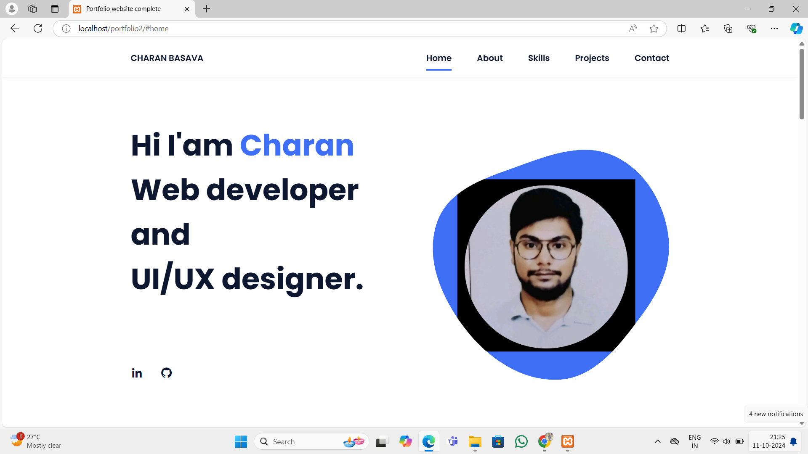
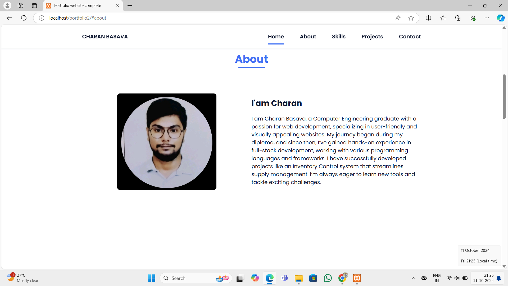
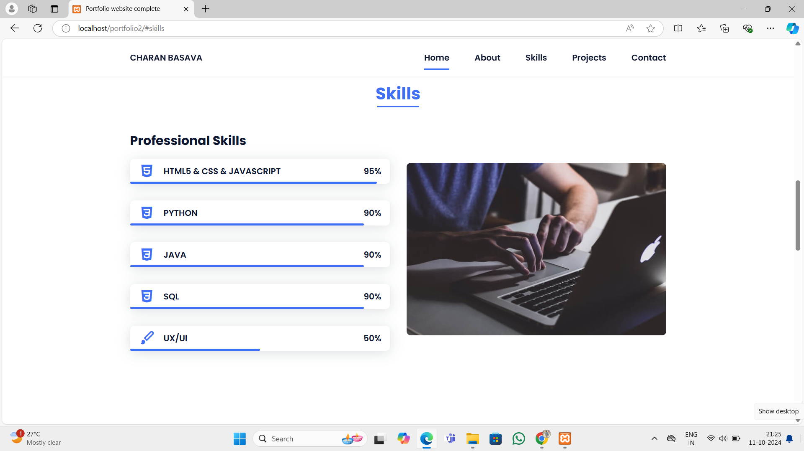
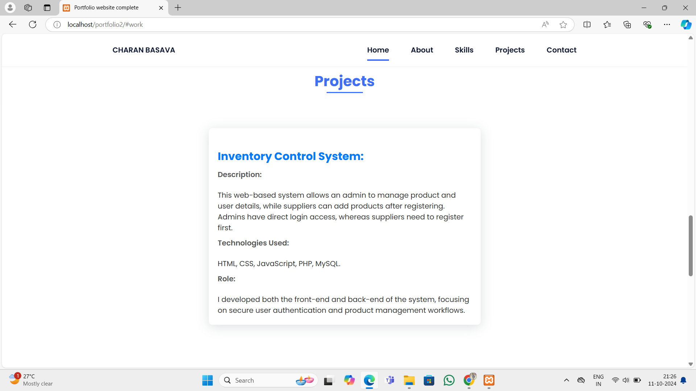
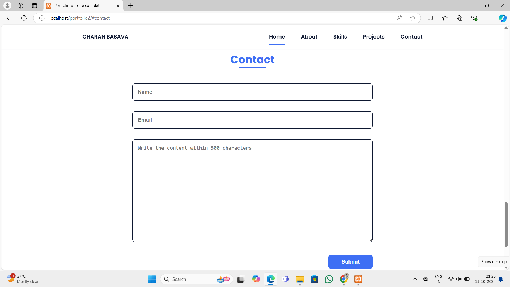

# personal-portfolio
This is a personal portfolio website designed to showcase my skills, experience, and projects in web development. The website is fully responsive, built using modern web technologies, and features an intuitive user interface for visitors to explore my profile and work.

## Project Overview
The ***Personal Portfolio Website*** is a web-based application designed to showcase my professional profile and web development projects. It includes multiple sections that provide a brief introduction, a detailed overview of my skills, information about projects, and a contact form that integrates email functionality using ***PHPMailer*** .

### Key Objectives:
- Present a clear and concise overview of my professional profile.
- Provide easy access to details about my skills and completed projects.
- Enable visitors to contact me through a simple and functional contact form.
- Deliver a responsive and visually appealing design across devices.

## Features
- **Home Page**: Brief information including my name, professional role, and an introduction.
- **About Page**: Detailed explanation of my background, experience, and professional journey.
- **Skills Page:**: A showcase of the technologies and tools I am proficient in, such as HTML, CSS, JavaScript, PHP, and MySQL.
- **Projects Page**: A list of key projects I have worked on, including "Inventory Control System" and this portfolio website.
- **Contact Page**: A simple contact form where users can reach me. Form submissions are sent directly to my email using PHPMailer.

## Technologies Used
- **PHP**:  Server-side scripting to handle form submissions.
- **MySQL**: Database management for storing form submissions.
- **JavaScript**: Client-side scripting for interactive features.
- **HTML/CSS**: Structure and styling of the web pages.
- **PHPMailer**: A popular PHP library for sending form data as email notifications.
-  **Server**: Local server environment used during development.

## Project output
## Some ScreenShots for this Project:
### Home page
 

### About page
  

### Skills page
 

### Projects page

### Contact page
  
